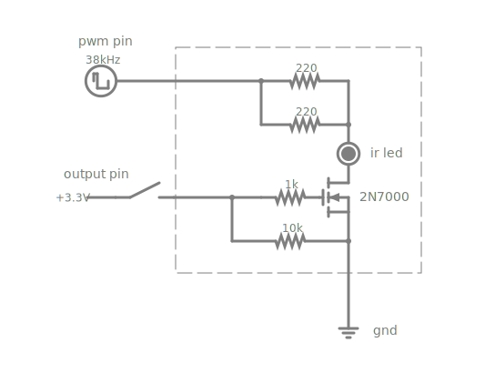



# Circuits

A collection of circuit simulations  
(*click circuit to go to Paul Falstad's simulator*)

## dc voltage sense

[](https://www.falstad.com/circuit/circuitjs.html?ctz=CQAgjCAMB0l3BWcMBMcUHYMGZIA4UA2ATmIxAUgpABZsKBTAWjDACgbJzDORttCIQgkH9B7AM60aePgIo0acwVQgAzAIYAbCQzYB3abIGyEivoVmQ2AJwVKxQ3o6po4tkDlHy8YbytoMazsvC1lQxStkeANPeUiQPBkjKFjQk0SeMNSAJUS-ZUS8KhcoWhLoeipq6AQ2bCU1fQATGwB7AAcAHQBHFFrwEGJKlGZWKFgaFFpoMCTiSAQwSDAaBAxiBGnVNj9pnhLLe2zpptbO3v6kasGYFbYADyFCemwwJAxxt9klAoAFADCvgwjyKh2IQzefAw01+010ADtdF0JB0AJYI0F4LIJPBJWhLWjgaYAcwRzTYJMSyVxNOKZWsACNEpAIZhBGYlDQNqkngtyPxZJsIQ0IHCQB02voGDYUejMQA3bIZDIoPEM8rEjUwOqGVXqhJqqyxQ0G5IuWIqo4JDLWJ7YYivKE0VZyLlasAoABqbCAA)

## ir led 28khz

[](https://www.falstad.com/circuit/circuitjs.html?ctz=CQAgjCAcB0BMsGYBskAsswAYCsskLCQFMBaAdhE2h0jDPtvUwE5JM0RtNORUFPSYMACgAHiBJgEFPBXJIQsMt1ThVAewCuAFwAOOgDoBnXQEsAdsIDm4MgoTJbCvrEqVhAJyjdYkSGtVff24sTExhIwk2RT8JQhjg8BAAMwBDABsjImEAJSifWMlfBLcVbgRofm5q6GwxOIxwRpIkZibVVTBVXQB3AFtjM0tkgJK6BSCQBFcqBSpMWGEe70V2FcJqpadwJBC7VeCt1H9J46nHcOXxqcxO-Yc5z15-B+3XkLCw+tgwxVRAhA+VAUTqqUweYzpIgAE2ECFUyR60I86l0BgAjhAsdAyF0ELhaMxfKEFqQKD5oMdCJAlLh4ZgyOgquBhIRXNcfv4OWRXK5EcjURisaVKNQRHlohsJMwFFKfFM2L8wNAkNhwCq1TVYHUvNFOdt9T4fk9JbttnLFMbxGBYrAiYppIpmGrQYoAHLKL7iH78PhteDOdC8NQgKzmWEAI0U2HsuLinUQ7mWkgmsTOk0uzxKeti4XUSVUKi4SHJ1DCEHm5bc7KmwiAA)