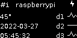
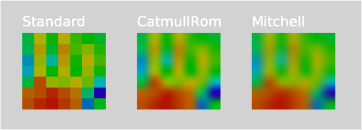
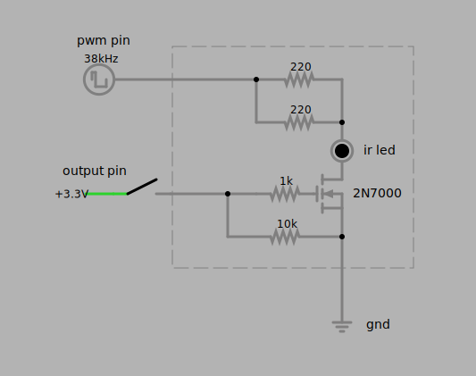



# Sharpi

C# Library for 64 bit Raspberry Pi OS (aarch64)

# <a name="classtable">
| Class|Description
| ----------- | ----------- |
| [Led](#led) | A simple red, green, blue, yellow or white led
| [Buzzer.Active](#buzzeractive) | Active buzzer (fixed frequency)
| [Buzzer.Passive](#buzzerpassive)| Passive buzzer (variable frequency)
| [Display.Drm](#displaydrm)| Direct Rendering Manager DRM Display
| [Display.Pcd8544](#displaypcd8544)| PCD8544 also known as Nokia screen
| [Display.Sh1106](#displaysh1106)| SH1106 Oled 128x64 screen
| [Display.Ssd1351](#displayssd1351)| SSD1351 Oled 128x128 screen
| [Display.Tm1637](#displaytm1637)| A 4-digit 7-segment display
| [Adc.Mcp3008](#adcmcp3008)| MCP3008 analog digital converter
| [Button](#button)| A debounced button with events
| [UsbWorker](#usbworker)| A serial connector for hotplugging Arduinos
| [Info](#info)| System information class
| [Sensor.Amg8833](#sensoramg8833)| AMG8833 infrared array sensor
| [Sensor.Ir28khz](#sensorir28khz)| A remote control infrared sensor
| [Sender.Ir28khz](#senderir28khz)| A remote control infrared sender
| [Pot.Ds3502](#potDs3502)| A digital potentiometer 4.5 - 15.5V, 1mA

<br/>

## <a name="led"></a>Led

A simple light emitting diode

```
 pin                     gnd
   |              ###      |
   |              led      |
   |              ###      |
   |            + | | -    |
   |            + | |      |
    ---- 220Ω ----|  ------
```

Example:

Power on the led connected to pin 11 (put in series 
to a 220 Ω current limiting resistor and ground) for 1 second.

```csharp
using Sharpi;

Led led = new Led(11);

Console.WriteLine(led.Description);

led.PowerOn();
Thread.Sleep(1000);
led.PowerOff();
```

[Back to list](#classtable)

<br/>

## <a name="buzzeractive"></a>Buzzer Active

Active buzzer with fixed (built in) frequency

```
  gnd     #####     pin
   |      buzzr      |
   |      #####      |
   |       | |       |
    -------   -------
```


Example: Beep for one second.

```csharp
using Sharpi;

Buzzer.Active active = new Buzzer.Active(11);

Console.WriteLine(active.Description);

active.PowerOn();
Thread.Sleep(1000);
active.PowerOff();
```

[Back to list](#classtable)

<br/>

## <a name="buzzerpassive"></a>Buzzer Passive

Passive buzzer with variable frequency

```
  gnd   vcc     #####     pwm
   |     |      buzzr     pin
   |     |      #####      |
   |     |      | | |      |
   |     -------  | |      |
    --------------   ------
```

Example:

Play some music on a passive piezo buzzer connected to the PWM0 pin.

```csharp
using Sharpi;

List<ValueTuple<int, int>> valkyre = new List<(int, int)>()
{
    (247, 150), (185, 75), (247, 150), (294, 448), (247, 448),(294, 150), (175, 75), (294, 150), 
    (370, 448), (294, 448), (370, 150), (294, 75), (370, 150), (440, 448 ), (220, 448), (294, 150), 
    (220, 75), (294, 150), (370, 732), (175, 150), (294, 150), (175, 75), (294, 150), (370, 448), 
    (294, 448), (370, 150), (294, 75), (370, 150), (440, 448), (370, 448), (440, 150), (370, 75),
    (440, 150), (554, 448), (277, 448), (370, 150), (277, 75), (370, 150), (440, 448)
};

Buzzer.Passive passive = new Buzzer.Passive(0);

Console.WriteLine(passive.Description);

passive.DutyPercent = 50;
passive.PowerOn();

for (int i=0; i< valkyre.Count(); i++)
{
    passive.Frequency = valkyre[i].Item1;    
    Thread.Sleep(valkyre[i].Item2);    
}

passive.PowerOff();
passive.Dispose();
```
[Back to list](#classtable)

<br/>

## <a name="displaydrm"></a>Display DRM

Direct Rendering Manager DRM Display


*If you have the desktop installed on the pi this can only work if your window manager is not claiming the display at the moment.
If the desktop is showing, you need to switch to a virtual terminal. If you are using ssh,
you can **ch**ange **v**irtual **t**erminal with `sudo chvt 1` and back to the desktop 
with `sudo chvt 7` or you can use a connected keyboard and key combinations `ctrl+alt+F1` and `ctrl+alt+F7`
to do the same.*


```
                         1920 (variable)
   ----------------------------------------------------    
  | |                                                | |
  | |                                                | |
  | |                                                | |  
  | |                                                | |
  | |                                                | |
  | |                                                | |  1080 (variable)
  | |                                                | |
  | |                                                | |
  | |                                                | |
  | |                                                | |  
  | |                                                | |
   ----------------------------------------------------    

Direct Rendering Manager DRM Display

prerequisite:
    sudo apt install libdrm-dev

wiring:
 connect a monitor (to HDMI)

not working if a window manager is currently claiming the display.                    

```

Example:

Output scrolling text with some UTF-8 characters, 
load and display a test bitmap, measure text for positioning and show the
current time with outlined text, draw a test line from top/left to bottom/right.

```csharp
using Sharpi;

Display.Drm display = new Display.Drm();

Console.WriteLine(display.Description);

Font font = new Font("DejaVu Sans", 250, Font.Edging.antialias);

Bitmap bitmap = display.GetBitmap();

Canvas canvas = new Canvas(bitmap);

Color color = new Color(0, 255, 255);

Paint paint1 = new Paint();
paint1.Color = new Color(255, 255, 255);

Paint paint2 = new Paint()
{
    Color = new Color(0, 0, 0),
    Stroke = true,
    StrokeWidth = 5.0f,
    AntiAlias = true
};

display.PowerOn();

canvas.Clear(color);
display.Update();

double fps = 0;
string fpsStr = "";
Stopwatch stopwatchFps = new Stopwatch();
stopwatchFps.Start();
for (uint i = 0; i < 1000; i += 10)
{
    fpsStr = $"Aöü: {fps:0.#}";
    canvas.Clear(color);    
    canvas.DrawText(fpsStr, i, 300, font, paint1);
    canvas.DrawText(fpsStr, i, 300, font, paint2);
    display.Update();

    fps = 1000.0f / stopwatchFps.ElapsedMilliseconds;
    stopwatchFps.Restart();
}

Thread.Sleep(2000);

Rect rect = font.MeasureText("00:00:00");
float x = (canvas.Width - rect.Width) / 2 - rect.Left;
float y = (canvas.Height - rect.Height) / 2 - rect.Top;

Bitmap testBitmap = new Bitmap("test.png");

DateTime time;
while (!Console.KeyAvailable)
{
    time = DateTime.Now;
    Thread.Sleep((ushort)(1000 - time.Millisecond));
    canvas.Clear(color);
    canvas.DrawBitmap(testBitmap, 0, 0);
    canvas.DrawText(time.ToString("HH:mm:ss"), x, y, font, paint1);
    canvas.DrawText(time.ToString("HH:mm:ss"), x, y, font, paint2);
    canvas.DrawLine(0, 0, 1920, 1080, paint1);
    display.Update();
}

display.PowerOff();

paint2.Dispose();
paint1.Dispose();
canvas.Dispose();
bitmap.Dispose();
font.Dispose();
display.Dispose();
```

[Back to list](#classtable)

<br/>

## <a name="displaypcd8544"></a>Display PCD8544

PCD8544 also known as Nokia screen

```
           84
   -------------------
  |                   |
  |  ---------------  |
  | |               | |
  | |               | |  48
  | |               | |
  | |               | |
  |  ---------------  |
   -------------------

PCD8544 also known as Nokia screen

config:

  edit /boot/config.txt
  dtparam=spi=on

wiring:

             1   2
             3   4
             5   6  -- gnd
             7   8
     gnd --  9   10
            11   12
            13   14 -- gnd
     vcc -- 15   16 -- dc
            17   18 -- rst
     din -- 19   20
            21   22
     clk -- 23   24 -- ce
     gnd -- 25   26
            27   28
            29   30
            31   32
            33   34
            35   36
            37   38
            39   40
```

Example:

Output 'Hello' on the screen using the Nimbus font.

```csharp
using Sharpi;


Display.Pcd8544 display = new Display.Pcd8544();

Console.WriteLine(display.Description);

Font font = new Font("Nimbus", 20, Font.Edging.alias);

Bitmap bitmap = display.GetBitmap();

Canvas canvas = new Canvas(display.GetBitmap());

Color color = new Color(255, 255, 255);

Paint paint = new Paint();
paint.Color = new Color(0, 0, 0);

display.PowerOn();

canvas.Clear(color);

canvas.DrawText("Hello", 15, 30, font, paint);

display.Update();

Thread.Sleep(5000);

display.PowerOff();

canvas.Dispose();
bitmap.Dispose();
font.Dispose();
display.Dispose();
```

[Back to list](#classtable)

<br/>

## <a name="displaysh1106"></a>Display SH1106

SH1106 Oled 128x64 screen

```
----------------------------------------------
SH1106 Oled 128x64 screen (I2c)

config:

  edit /boot/config.txt
  dtparam=i2c_arm=on,i2c_arm_baudrate=400000

wiring:

       rpi physical pins

     vdd --  1   2
     sda --  3   4
     scl --  5   6
             7   8             -------------
     gnd --  9   10           | |         | |
            11   12      sda -| |         | |
            13   14      sck -| |         | |
            15   16      gnd -| |         | |
            17   18      vdd -| |         | |
            19   20           | |         | |
            21   22            -------------
            23   24
            25   26
            27   28
            29   30
            31   32
            33   34
            35   36
            37   38
            39   40

----------------------------------------------
```

Example:

At the top show a 16x16 pixel logo, the hostname and a voltage indicator.
Show cpu temperature, date, time and on the right show an alive animation or a flat line.



```csharp
using Sharpi;

// load some bitmaps
Bitmap logo =new Bitmap("logo16x16.bmp");
Bitmap[] alive16x16 = new Bitmap[8];
for (int i = 0; i < alive16x16.Count(); i++)
{
    alive16x16[i] = new Bitmap($"alive{i}_16x10.bmp");
}
Bitmap flatline = new Bitmap("flatline16x10.bmp");
Bitmap voltage8x12 = new Bitmap("voltage8x12.bmp");

// create display
Display.Sh1106 display = new Display.Sh1106();

Console.WriteLine(display.Description);

display.PowerOn();

Font font = new Font("Libertine", 11, Font.Edging.alias);

Paint paint = new Paint()
{
    Color = new Color(255, 255, 255),
};

Bitmap bitmap = display.GetBitmap();

Canvas canvas = new Canvas(bitmap);

Color black = new Color(0, 0, 0);

DateTime Now = DateTime.Now;
int second = Now.Second;
bool[] isAlive = { true, false, true};
bool voltage = true;
string hostname = Info.GetHostname();
int count = 0;

while (!Console.KeyAvailable)
{
    Now = DateTime.Now;

    if (second != Now.Second)
    {
        canvas.Clear(black);
        canvas.DrawBitmap(logo);

        canvas.DrawText("d1", 93, 32, font, paint);
        canvas.DrawBitmap(isAlive[0] ? alive16x16[second % 8] : flatline, 112, 20);

        canvas.DrawText("d2", 93, 48, font, paint);
        canvas.DrawBitmap(isAlive[1] ? alive16x16[second % 8] : flatline, 112, 36);

        canvas.DrawText("d3", 93, 64, font, paint);
        canvas.DrawBitmap(isAlive[2] ? alive16x16[second % 8] : flatline, 112, 52);

        if (voltage)
        {
            canvas.DrawBitmap(voltage8x12, 116, 0);
        }

        canvas.DrawText(hostname, 26, 12, font, paint);
        canvas.DrawText($"{Math.Round(Info.GetTemperature())}°C", 0, 32, font, paint);
        canvas.DrawText(Now.ToString("yyyy-MM-dd"), 0, 48, font, paint);
        canvas.DrawText(Now.ToString("HH:mm:ss"), 0, 64, font, paint);

        // create 8 screenshots / capture first 8 frames
        // to create a gif: ffmpeg -i -framerate 1 screen%02d.png sh1106.gif
        if (count < 8)
        {
            bitmap.EncodeToFile($"./screen{count,2:D2}.png", Bitmap.EncodingFormat.PNG);
            count++;
        }

        display.Update();

        second = Now.Second;
    }

    Thread.Sleep(50);
}

display.Dispose();


for (int i = 0; i < alive16x16.Count(); i++)
{
    alive16x16[i].Dispose();
}
flatline.Dispose();
voltage8x12.Dispose();
```

[Back to list](#classtable)

<br/>

## <a name="displayssd1351"></a>Display SSD1351

SSD1351 Oled 128x128 screen

```
           128
   --------------------    
  | |                | |
  | |                | |
  | |                | |  128
  | |                | |
  | |                | |
  | |                | |
   --------------------

SSD1351 Oled 128x128 screen             
                                        
config:                                 
                                        
  edit /boot/config.txt                 
  dtparam=spi=on                        
  dtoverlay=spi1-1cs (optional for 2nd SPI)
                                        
wiring:                                                                         
                                        
  _0 for SPI 0 and _1 for SPI 1         
                                        
     3.3v -- 1   2  -- 5v               
             3   4  -- 5v               
             5   6  -- gnd              
             7   8                      
     gnd --  9   10                     
            11   12 -- cs_1             
   rst_1 -- 13   14 -- gnd              
    dc_1 -- 15   16 -- dc_0             
            17   18 -- rst_0            
  din_0 --  19   20                     
            21   22                     
   clk_0 -- 23   24 -- cs_0             
     gnd -- 25   26                     
            27   28                     
            29   30                     
            31   32                     
            33   34                     
            35   36                     
            37   38 -- din_1            
            39   40 -- clk_1            
```

Example:

Show a bitmap loaded from a file and scroll the names of available fonts.

```csharp
using Sharpi;

Console.WriteLine(display.Description);

Font font = new Font("Noto Mono", 20, Font.Edging.alias);

// get the list of font families on the system
List<string> fontNames = Font.Names();

// create a bitmap to draw all fontnames on
Bitmap fontsScrollBitmap = new Bitmap(128, fontNames.Count * 14);

// load a splash bitmap from file
Bitmap splashBitmap = new Bitmap("splash.png"); 

// create a canvas for the fonts bitmap
Canvas fontsCanvas = new Canvas(fontsScrollBitmap);

Paint fontPaint = new Paint()
{
    Color = new Color(0, 255, 255),    
};

// draw the font names on the fontCanvas (thereby changing the underlying bitmap)
for (int i = 0, y = 12; i < fontNames.Count; i++, y += 14)
{
    using (Font fontFont = new Font(fontNames[i], 12, Font.Edging.alias))
    {       
        fontsCanvas.DrawText(fontNames[i], 0, y, fontFont, fontPaint);
    }    
}

// get the display's bitmap
Bitmap bitmap = display.GetBitmap();

// create a canvas for the display's bitmap to draw onto it
Canvas canvas = new Canvas(bitmap);

Color black = new Color(0, 0, 0);

display.PowerOn();

// clear screen, draw the splash bitmap, update display
canvas.Clear(black);
canvas.DrawBitmap(splashBitmap);
display.Update();

Thread.Sleep(2000); // or await Task.Delay(2000);

// scroll the fonts bitmap
Rect src = new Rect(0, 0, 128, 128);
Rect dst = new Rect(0, 0, 128, 128);

for (int y=0; y<fontsScrollBitmap.Height- 128; y++)
{
    canvas.Clear(black);
    src.Top = y;
    src.Bottom = y + 128;
    canvas.DrawBitmap(fontsScrollBitmap, src, dst);
    display.Update();
    Thread.Sleep(10);    
}

Thread.Sleep(1000);

canvas.Dispose();
bitmap.Dispose();
fontPaint.Dispose();
fontsCanvas.Dispose();
splashBitmap.Dispose();
fontsScrollBitmap.Dispose();
display.Dispose();
```

[Back to list](#classtable)

<br/>

## <a name="displaytm1637"></a>Display TM1637

A 4-digit 7-segment display

```
  _   _     _   _
 |_| |_| # |_| |_|
 |_| |_| # |_| |_|

TM1637 7 segment LCD Titan Micro Elec.

             1   2
             3   4
             5   6  -- gnd
             7   8
     gnd --  9   10
            11   12
            13   14 -- gnd
     vcc -- 15   16 -- dio
            17   18 -- clk
            19   20
            21   22
            23   24
     gnd -- 25   26
            27   28
            29   30
            31   32
            33   34
            35   36
            37   38
            39   40

supported characters:
  ":'-0123456789ACEFLOPSbdr°
```

Example:

Rotate the display 180 degrees, set brightness level, show text.

```csharp
using Sharpi;

Display.Tm1637 display = new Display.Tm1637();

Console.WriteLine(display.Description);

display.SetRotation(true);
display.SetBrightness(2);

display.SetText("20°C");
Thread.Sleep(1000);

display.SetText("11:30");
Thread.Sleep(1000);

display.SetText("1234");
Thread.Sleep(1000);

display.SetText("  42");
Thread.Sleep(1000);

display.SetText("42  ");
Thread.Sleep(1000);

display.Dispose();
```

[Back to list](#classtable)

<br/>

## <a name="adcmcp3008"></a>Adc Mcp3008

MCP3008 analog to digital converter (resolution 10 bit, 8 channels)

```
------------------------------------------------------------
MCP3008 8-Channel 10-Bit A/D Converter
       Microchip Technology Inc.

config:

  edit /boot/config.txt
  dtparam=spi=on
  dtoverlay=spi1-1cs (optional for SPI 2)

wiring:

       rpi physical pins

  _0 for SPI 0 and _1 for SPI 1

     3.3v -- 1   2  -- 5v
             3   4  -- 5v
             5   6  -- gnd
             7   8
     gnd --  9   10                       --__--
            11   12 -- cs_1       ch0 -- | o    | -- vdd
   rst_1 -- 13   14 -- gnd        ch1 -- |      | -- vref
    dc_1 -- 15   16 -- dc_0       ch2 -- |      | -- a_gnd
            17   18 -- rst_0      ch3 -- |      | -- clk
   din_0 -- 19   20               ch4 -- |      | -- dout
  dout_0 -- 21   22               ch5 -- |      | -- din
   clk_0 -- 23   24 -- cs_0       ch6 -- |      | -- cs
     gnd -- 25   26               ch7 -- |      | -- d_gnd
            27   28                       ------
            29   30
            31   32
            33   34
            35   36
            37   38 -- din_1
            39   40 -- clk_1
------------------------------------------------------------
```

Example:

Read from channel 0, output the 10 bit value 0,..,1023 and the
voltage corresponding to vref (assumed to be wired to 3.3V)

```csharp
using Sharpi;

Adc.Mcp3008 mcp3008 = new Adc.Mcp3008();

Console.WriteLine(mcp3008.Description);

Console.WriteLine();
while (!Console.KeyAvailable)
{
    Console.CursorTop -= 1;
    int value = mcp3008.Read(0);
    float volts = 3.3f / 1023 * value;
    Console.WriteLine($"Reading {value} from channel 0 <=> {volts}V ");

    Thread.Sleep(1000);
}
```

[Back to list](#classtable)

<br/>

## <a name="button"></a>Button

A debounced button with events

```
      useExtResistor = false

        pin          3v3
         |            |
          --- push ---
             button


       useExtResistor = true

  gnd          pin          3v3
   |            |            |
    --- 10kΩ --- --- push ---
      resistor      button
```

Example:

Use automatic updates with events and use internal pulldown.

```csharp
using Sharpi;

void Button_Changed(object sender, Button.EventArgs e)
{
    Console.WriteLine($"button on pin {e.Pin} pressed {e.Pressed}");
}

Button button = new Button(8, true);

Console.WriteLine(button.Description);

button.Pressed += Button_Changed;
button.Released += Button_Changed;

while (!Console.KeyAvailable)
{
    Thread.Sleep(500);
}

button.Pressed -= Button_Changed;
button.Released -= Button_Changed;

button.Dispose();
```

[Back to list](#classtable)

<br/>

## <a name="usbworker"></a>UsbWorker

A serial connector for hotplugging Arduinos


```
                                                
                                    ----------- 
   ----------------------     -----|  Arduino  |
  |                      |   |      ----------- 
  |    Raspberry     USB |---       ----------- 
  |                  USB |---------|  Arduino  |
  |        Pi        USB |---       ----------- 
  |                      |   |      ----------- 
   ----------------------     -----|  Arduino  |
                                    ----------- 

```

Example Arduino:


Send ULC in the loop to identify the device, listen to commands
"on" or "off", turn on or off the onboard led and send "Led on" / "Led off" accordingly.
```cpp

#define DEVICEID 1

#define STR_H(x) #x
#define STR(x) STR_H(x)
#define ULC "\xF" STR(DEVICEID) "\xE"

// ------------------------ UsbWorker --------------------------
// 1. set DEVICEID to a unique positive integer value  1, 2,.. 
//
// 2. prepend your data with ULC or send ULC alone.
//
//    example: 
//      Serial.print(ULC); Serial.println("my data 12345");
//    or:
//      Serial.println(ULC);
//      
// 3. if no ULC is sent within x milliseconds (default 1500)
//    the device is considered dead (failure or unplugged)
// -------------------------------------------------------------

void setup() 
{
  Serial.begin(38400);  
  
  pinMode(LED_BUILTIN, OUTPUT);  
}

String cmd = "";

void loop() 
{
    while (Serial.available() > 0)
    {
        char cmdChar = Serial.read();        
        
        if (cmdChar == '\n') 
        {
            if (cmd == "on") 
            {
                digitalWrite(LED_BUILTIN, HIGH);
                Serial.print(ULC); Serial.println("Led on");
            }
            else if (cmd == "off")
            {
                digitalWrite(LED_BUILTIN, LOW);
                Serial.print(ULC); Serial.println("Led off");
            }
            else
            {
                Serial.print(ULC); Serial.println("unknown command");
            }

            cmd="";
        }
        else 
        {
            cmd += cmdChar;
        }
  }
  
  Serial.println(ULC);
  
  delay(100);
}

```
Example:

Add two UsbWorkers, add event handlers and wait for user commands.

```csharp
using Sharpi;

void UsbWorker_StateChanged(object sender, UsbWorker.StateEventArgs e)
{
    Console.WriteLine($"device:{e.DeviceId} state:{e.State.ToString()}");
}

void UsbWorker_NewData(object sender, UsbWorker.DataEventArgs e)
{
    Console.WriteLine($"device:{e.DeviceId} data:{e.Data}");
}

UsbWorker usbWorker1 = new UsbWorker(1, UsbWorker.Baud.B38400);
UsbWorker usbWorker2 = new UsbWorker(2, UsbWorker.Baud.B38400);


usbWorker1.StateChanged += UsbWorker_StateChanged;
usbWorker1.NewData += UsbWorker_NewData;

usbWorker2.StateChanged += UsbWorker_StateChanged;
usbWorker2.NewData += UsbWorker_NewData;


Console.WriteLine("- plug in/out devices to test state changes");
Console.WriteLine("- type command and enter:  \"on 1\", \"off 1\", \"on 2\", \"off 2\", \"q\"");

string? cmd = "";
while (cmd != "q")
{
    if (Console.KeyAvailable)
    {
        cmd = Console.ReadLine();
        if (cmd != null)
        {
            switch (cmd)
            {
                case "on 1":
                    usbWorker1.WriteLine("on");
                    break;
                case "off 1":
                    usbWorker1.WriteLine("off");
                    break;
                case "on 2":
                    usbWorker2.WriteLine("on");
                    break;
                case "off 2":
                    usbWorker2.WriteLine("off");
                    break;
            }
        }

    }
    Thread.Sleep(100);
}

usbWorker1.StateChanged -= UsbWorker_StateChanged;
usbWorker1.NewData -= UsbWorker_NewData;

usbWorker2.StateChanged -= UsbWorker_StateChanged;
usbWorker2.NewData -= UsbWorker_NewData;

usbWorker1.Dispose();
usbWorker2.Dispose();
```

[Back to list](#classtable)

<br/>

## <a name="info"></a>Info

System information class

```
CPU/GPU/SoC temp: 45.3 °C
CPU/GPU/SoC temp: 113.5 °F

Hostname: raspberrypi
SoC     : BCM2835
Model   : Raspberry Pi 4 Model B Rev 1.4

Memory:
TOTAL   :  3886092.0 KiB (3.0 GiB)
VIRT    :  2985496.0 KiB (2915.0 MiB)
RES     :    35912.0 KiB
SHR     :    29016.0 KiB
PRVT    :     6896.0 KiB
```

Example:

Print temperature, hostname, SoC, revision, 
serial number and model name to standard output.
Additionally output memory information in a loop while producing a
test memory leak.

```csharp
using Sharpi;

float temperature = Info.GetTemperature();
string hostname = Info.GetHostname();

Console.WriteLine($"CPU/GPU/SoC temp: {temperature.ToString("F1")} °C");
Console.WriteLine($"CPU/GPU/SoC temp: {(temperature * 1.8f + 32).ToString("F1")} °F");
Console.WriteLine();
Console.WriteLine($"Hostname: {hostname}");
Console.WriteLine($"SoC     : {Info.SoC}");
Console.WriteLine($"Revision: {Info.Revision}");
Console.WriteLine($"Serial  : {Info.Serial}");
Console.WriteLine($"Model   : {Info.Model}");
Console.WriteLine();

for (int i = 0; i < 6; i++) { Console.WriteLine(); }

while (!Console.KeyAvailable)
{
    var memInfo = Info.GetMemoryInfo();

    // produce a mem leak for testing
    Bitmap memleakdummy = new Bitmap(64, 64);

    Console.CursorTop -= 6;
    Console.WriteLine("Memory:");
    Console.WriteLine($"TOTAL   : {memInfo.Total / 1024,10:F1} KiB ({memInfo.Total / (1024 * 1024 * 1024),0:F1} GiB)");
    Console.WriteLine($"VIRT    : {memInfo.VirtualSize / 1024,10:F1} KiB ({memInfo.VirtualSize / (1024 * 1024),0:F1} MiB)");
    Console.WriteLine($"RES     : {memInfo.ResidentSize / 1024,10:F1} KiB");
    Console.WriteLine($"SHR     : {memInfo.ResidentShared / 1024,10:F1} KiB");
    Console.WriteLine($"PRVT    : {memInfo.ResidentPrivate / 1024,10:F1} KiB");

    Thread.Sleep(1000);
}
```

[Back to list](#classtable)

<br/>

## <a name="sensoramg8833"></a>Sensor Amg8833

AMG8833 Infrared array sensor also known as Grid-Eye

```
----------------------------------------------
Amg8833 also known as Grid-Eye

config:

  edit /boot/config.txt
  dtparam=i2c_arm=on,i2c_arm_baudrate=400000

wiring:

       rpi physical pins

     vin --  1   2
     sda --  3   4
     scl --  5   6
             7   8
     gnd --  9   10            -------------
   (int) -- 11   12      vin -|             |
            13   14       3v -|     ---     |
            15   16      gnd -|    |   |    |
            17   18      sda -|    | # |    |
            19   20      scl -|     ---     |
            21   22      int -|             |
            23   24            -------------
            25   26
            27   28
            29   30
            31   32
            33   34
            35   36
            37   38
            39   40

----------------------------------------------
```

Example 1:

Power on, output description, read thermistor (as temperature), 
set interrupt high, low and small hysteresis. 
Read grid temperatures and interrupts and output in a loop.
Check if interrupt occured using function and output text if true 
(also int pin has falling edge in this case).
```
Thermistor: 22.8125 °C


                        +       +       +       +       +
                        +       +       +       +       +
                        +       +       +       +       +
                +       +       +       +       +       +
+               +       +       +       +       +       +
+               +       +       +       +       +       +
+       +       +       +       +       +       +       +

Interrupt occured

23.25   25.25   24.25   24.75   25.25   25.75   25.25   24.25
21.25   20.55   23.75   26.25   26.75   26.75   26.75   26.75
19.55   20.25   21.55   27.25   27.25   27.75   27.55   27.25
20.75   20.55   24.25   27.75   27.55   28.25   28.25   27.75
25.75   21.55   26.25   28.25   28.75   28.25   28.75   27.55
26.55   23.25   27.25   28.55   28.55   28.55   28.25   27.75
27.55   25.25   28.25   28.25   28.75   28.75   28.55   28.25
28.25   28.25   29.55   28.55   28.75   28.55   28.55   27.75
```

```csharp
using Sharpi;

Sensor.Amg8833 amg8833 = new Sensor.Amg8833(0x69);

amg8833.PowerOn(); // 5.6 mA 

Console.WriteLine(amg8833.Description);

 float thermistor =  amg8833.ReadThermistor();

Console.WriteLine($"Thermistor: {thermistor} °C");
Console.WriteLine();

amg8833.SetInterrupt(Sensor.Amg8833.InterruptMode.Absolute, 26, 10, 1);

while (!Console.KeyAvailable)
{
    bool[,] ints = amg8833.ReadInterrupts();

    for (int i = 0; i < 8; i++)
    {
        for (int j = 0; j < 8; j++)
        {
            Console.Write((ints[i, j] ? "+" : " ") + "\t");
        }

        Console.WriteLine();
    }

    Console.WriteLine();

    if (amg8833.CheckInterrupt()) // alternatively the int pin can be checked for falling edge
    {
        Console.WriteLine("Interrupt occured");
    }
    else
    {
        Console.WriteLine("                 ");
    }

    Console.WriteLine();

    float[,] temps = amg8833.ReadTemperatures();

    for (int i = 0; i < 8; i++)
    {
        for (int j = 0; j < 8; j++)
        {
            Console.Write(temps[i, j] + "\t");
        }

        Console.WriteLine();
    }

    Console.CursorTop -= 19;
    
    Thread.Sleep(100);
}

Console.CursorTop += 19;

amg8833.PowerOff(); // 0.55 mA

amg8833.Dispose();
```

<br/>

Example 2:

Use the [Drm Display](#displaydrm) (HDMI monitor) to output scaled images of the heatmap returned by
the sensor until a key is pressed. Finally save a screenshot.



```csharp
using Sharpi;

Font font = new Font("DejaVu Sans", 42, Font.Edging.antialias);
Paint paint = new Paint { Color = new Color(255, 255, 255) };

Display.Drm display = new Display.Drm();
Bitmap bitmap = display.GetBitmap();
Canvas canvas = new Canvas(bitmap);
display.PowerOn();

Sensor.Amg8833 amg8833 = new Sensor.Amg8833(0x69);
amg8833.PowerOn();

while (!Console.KeyAvailable)
{
    Bitmap heatmap = amg8833.ReadHeatMap(20, 30 );
    canvas.DrawText("Standard", 50, 50, font, paint);
    canvas.DrawBitmap(heatmap, new Rect(0, 0, 7, 7), new Rect(50, 70, 305, 305));

    canvas.DrawText("CatmullRom", 400, 50, font, paint);
    canvas.DrawBitmap(heatmap, new Rect(0, 0, 7, 7), new Rect(400, 70, 655, 305), Canvas.CubicSampling.CatmullRom);

    canvas.DrawText("Mitchell", 750, 50, font, paint);
    canvas.DrawBitmap(heatmap, new Rect(0, 0, 7, 7), new Rect(750, 70, 1005, 305), Canvas.CubicSampling.Mitchell);

    display.Update();
    Thread.Sleep(100);
}

bitmap.EncodeToFile("./screenshot.png", Bitmap.EncodingFormat.PNG);

amg8833.PowerOff();

amg8833.Dispose();

display.PowerOff();

display.Dispose();
```


[Back to list](#classtable)

<br/>

## <a name="sensorir28khz"></a>Sensor Ir28khz

A remote control infrared sensor

```
----------------------------------------------
Infrared sensor (receiver module), 38khz

config:

  nothing to do

wiring:

       rpi physical pins

    3.3V --  1   2
             3   4
             5   6
             7   8          ---------
     gnd --  9   10        |  -----  |
   (dat) -- 11   12        | |     | |
            13   14        |  -----  |
            15   16         ---------
            17   18          |  |  |
            19   20        dat gnd 3.3V
            21   22
            23   24
            25   26
            27   28
            29   30
            31   32
            33   34
            35   36
            37   38
            39   40

----------------------------------------------
```

Example:

Add an event handler, output description, power on and receive NEC codes from a remote control.

```
0xBF00 0x1A
0xBF00 0x1A
0xBF00 0x1B
0xBF00 0x40
0xBF00 0x42
0xBF00 0x46
0xBF00 0x04
0xBF00 0x04
```

```csharp
using Sharpi;

void Sensor_NewNec(object sender, Sensor.Ir28khz.NecEventArgs e)
{
    Console.WriteLine($"0x{e.Address,4:X4} 0x{e.Command,2:X2}");
}


Sensor.Ir28khz sensor = new Sensor.Ir28khz(11, true);

sensor.NewNec += Sensor_NewNec;

Console.WriteLine(sensor.Description);

sensor.PowerOn();

while (!Console.KeyAvailable)
{
    Thread.Sleep(100);
}

sensor.PowerOff();

sensor.NewNec -= Sensor_NewNec;

sensor.Dispose();
```

[Back to list](#classtable)

## <a name="senderir28khz"></a>Sender Ir28khz

A remote control infrared sender using a DIY circuit

[](https://www.falstad.com/circuit/circuitjs.html?ctz=CQAgjCAcB0BMsGYBskAsswAYCsskLCQFMBaAdhE2h0jDPtvUwE5JM0RtNORUFPSYMACgAHiBJgEFPBXJIQsMt1ThVAewCuAFwAOOgDoBnXQEsAdsIDm4MgoTJbCvrEqVhAJyjdYkSGtVff24sTExhIwk2RT8JQhjg8BAAMwBDABsjImEAJSifWMlfBLcVbgRofm5q6GwxOIxwRpIkZibVVTBVXQB3AFtjM0tkgJK6BSCQBFcqBSpMWGEe70V2FcJqpadwJBC7VeCt1H9J46nHcOXxqcxO-Yc5z15-B+3XkLCw+tgwxVRAhA+VAUTqqUweYzpIgAE2ECFUyR60I86l0BgAjhAsdAyF0ELhaMxfKEFqQKD5oMdCJAlLh4ZgyOgquBhIRXNcfv4OWRXK5EcjURisaVKNQRHlohsJMwFFKfFM2L8wNAkNhwCq1TVYHUvNFOdt9T4fk9JbttnLFMbxGBYrAiYppIpmGrQYoAHLKL7iH78PhteDOdC8NQgKzmWEAI0U2HsuLinUQ7mWkgmsTOk0uzxKeti4XUSVUKi4SHJ1DCEHm5bc7KmwiAA)

Example:

Using Pwm0 and pin 11 (output pin) to send command 0x16 to receiver with address 0xBF00.

```csharp
using Sharpi;

Sender.Ir28khz sender = new Sender.Ir28khz(0, 11);

Console.WriteLine(sender.Description);

sender.PowerOn();

sender.Send(0xBF00, 0x16);

while (!Console.KeyAvailable)
{
    Thread.Sleep(100);
}

sender.PowerOff();
```

[Back to list](#classtable)

## <a name="potDs3502"></a>Pot Ds3502

A digital potentiometer analog 4.5-15.5V, 1mA

```
----------------------------------------------
 Maxim DS3502

 The DS3502 is a 7-bit, nonvolatile (NV)
 digital potentiometer (POT) featuring an
 output voltage range of up to 15.5V.
 Programming is accomplished by an I2C-
 compatible interface, which can operate at
 speeds of up to 400kHz.External voltages are
 applied at the RL and RH inputs to define the
 lowest and highest potentiometer outputs.
 (10 uSOP package)

 I2c slave address adjustable via A0 and A1

 A convenient breakout board is available
 from Adafruit.

config:

  edit /boot/config.txt
  dtparam=i2c_arm=on,i2c_arm_baudrate=400000

wiring:

       rpi physical pins

     vin --  1   2
     sda --  3   4
     scl --  5   6
             7   8
     gnd --  9   10         ----------
   (int) -- 11   12   sda -| +        |- scl
            13   14   gnd -|          |- v+
            15   16   vcc -|  ds3502  |- rl
            17   18    a1 -|          |- rw
            19   20    a0 -|          |- rh
            21   22         ----------
            23   24
            25   26
            27   28
            29   30
            31   32
            33   34
            35   36
            37   38
            39   40

----------------------------------------------
```

Example:

```csharp
using Sharpi;

Ds3502 ds3502 = new(0x28);

ds3502.PowerOn();
ds3502.SetWiper(10);

byte test = GetWiper();

while(somecondition)
{
    // do something
}

ds3502.SetWiperPersistent(10);
ds3502.PowerOff();
ds3502.Dispose();

```

[Back to list](#classtable)
